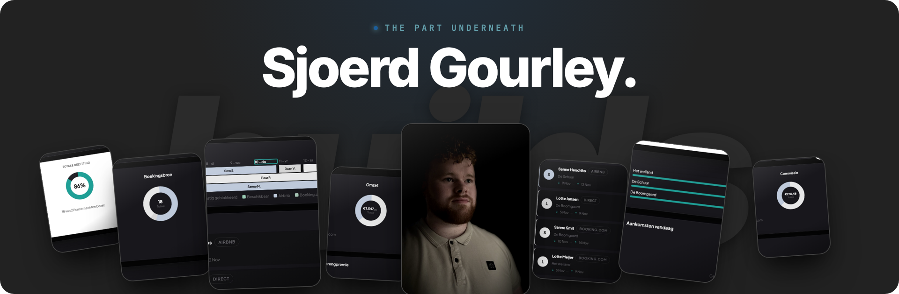

### Everyone clones the Netflix interface. Nobody builds the billing behind it.

I help freelancers and small agencies build past the design into accounts, billing and sync, and sell what they build. That means rebuilding platforms like Netflix and Airbnb on camera, and closing real clients in public.

#### What I'm building

**[Fidestay](https://fidestay.nl)** · `Live` 
A booking marketplace plus the channel manager behind it, for B&B and small hotel owners in the Netherlands, launching in Limburg. Hosts publish once and their availability stays right everywhere else. Taking bookings, with the first host on it.

**[The YouTube channel](https://youtube.com/@sjoerdgourley)** · `Nothing published yet` 
One big platform at a time, rebuilt on camera all the way down to the part that takes the money. English, long form. It will say here when the first one is out.

**The community** · `Not open yet` 
A paid place next to the channel for people who want to go further than a video can take them.

**Client builds** · `Open` 
The hard end of the web: platforms and the payment systems underneath them. The first one was my mother's B&B, and it turned into Fidestay.

#### Before the code

I ran my own sales office and trained more than a hundred people to sell. Most builders can make the thing and then wait for someone to refer them. I would rather you could go and get the work yourself.

#### This repo

The source of [sjoerdgourley.com](https://sjoerdgourley.com): one HTML file, one stylesheet, one serverless function for the contact form, and no build step. My other repos stay private until the code is worth reading.

#### Where I post

[YouTube](https://youtube.com/@sjoerdgourley) gets the long builds, [Instagram](https://instagram.com/sjoerdgourley) gets the selling half, [X](https://x.com/sjoerdgourley) gets the working notes, and this is where the code goes.

Stuck underneath your own build? Write to **[hello@sjoerdgourley.com](mailto:hello@sjoerdgourley.com)**. I answer in English or Dutch.

● Currently building <b>Fidestay</b>
